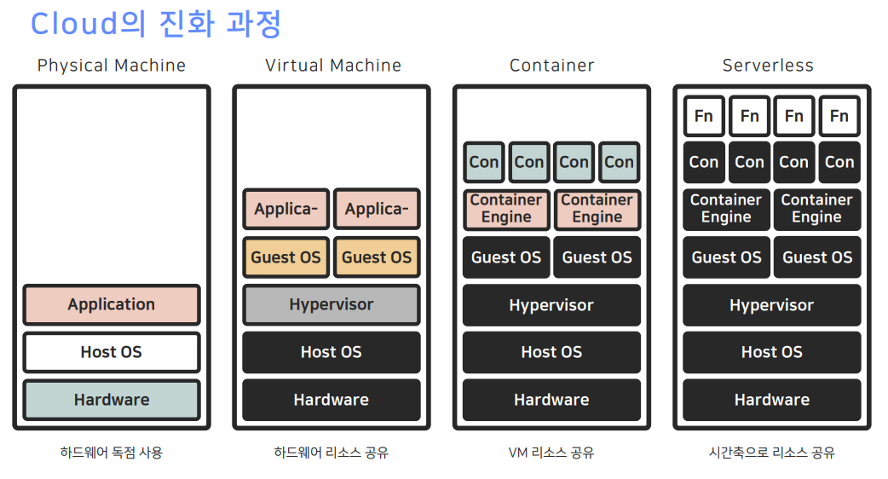
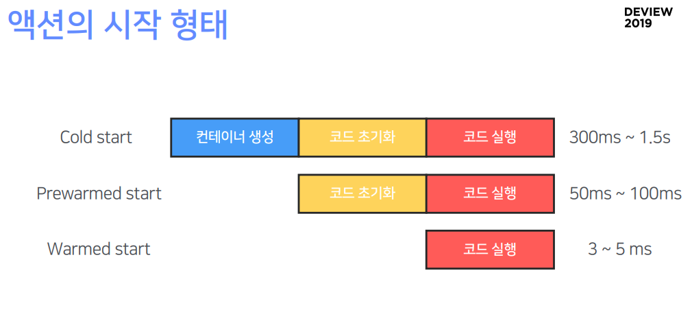

# Multi-Tenancy Kubernetes on Bare Metal Servers

- Minimalism People (꼭 필요한 일만...)

- 멀티테넌시란 [link](http://www.itworld.co.kr/news/101255)

  - Multi-Tenancy Kubernetes
  - 하나의 쿠베를 네임스페이스로 나눠서 사용자에게 제공

- 기술 변화
  - ??? 1년
  - 도커스웜 3년
  - 쿠베 1년

* 달리는 마차에 바퀴를 갈아끼운다.
* 갈라파고스가 아니다라는 안도
* 쿠베를 도입하고자 한다면, 한두명의 사람이 쿠베에 대해서 잘 알고 있어야 한다. 생각보다 어렵다.

- 컨테이너가 너무 쉬우니까 만들었다 파괴했다 하는 작업이 많다.

# ms단위의ServerlessWorld에서 Docker의성능한계극복하기

- 서버리스 서비스
  - Auth0 : 인증
  - TriggerMesh : 앱관리
  - puresec : 보안
  - lumigo : 모니터링
  - nuclio : data science

- 서버리스의 종류

  - Baas : Backend as a Service
  - Daas : Database as Service
  - Fass : Function as Service

- Container

  - 콜드스타트
  - 프리웜드 스타트
  - 웜드 스타트
    

- Docker Daemon 벤치마크 결과

  - run rm : 500ms ~ 1.3s
  - pause, unpause : 50ms ~ 400ms

- 컨트롤러가 스케쥴링

# 속도의 속도에 의한 속도를 위한 몽고DB (네이버 컨텐츠검색과 몽고DB)

# FE 프레임워크를 배우는 기분

# node.js 모니터링을 위한 APM 개발기
